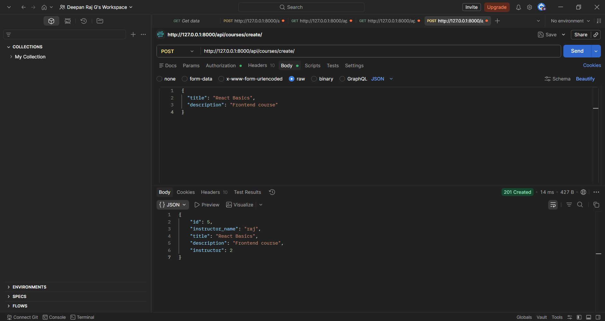
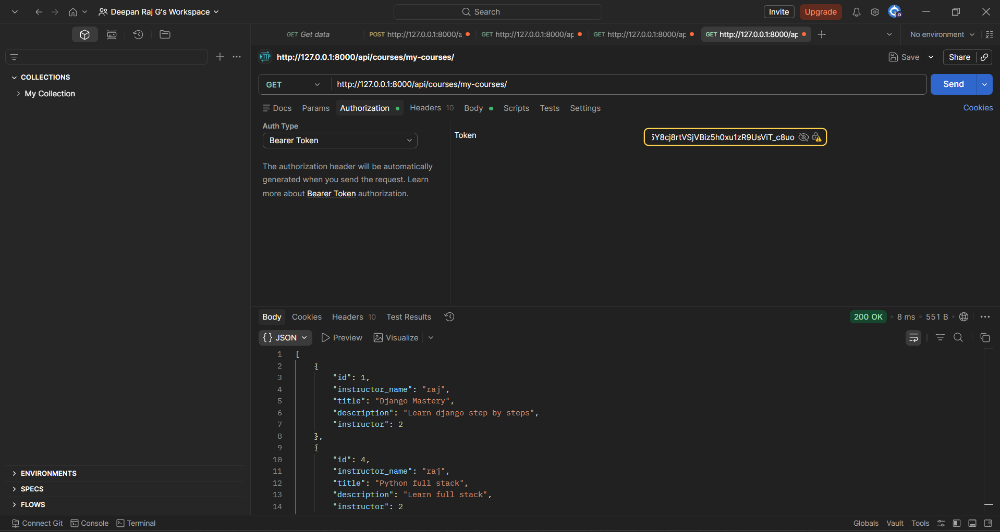

# LMS Backend (Django + DRF)

## 🚀 Features

* JWT Authentication
* Custom User Roles (Admin, Instructor, Student)
* Role-Based Access Control (RBAC)
* Course Management (Create, List, Detail, Update, Delete)
* Enrollment System
* Student Dashboard (My Courses)
* Instructor Dashboard

## 🛠 Tech Stack

* Python
* Django
* Django REST Framework
* JWT Authentication

## 📌 API Endpoints

* /api/users/register/
* /api/token/
* /api/courses/
* /api/courses/create/
* /api/courses/enroll/
* /api/courses/my-courses/
* /api/courses/instructor-courses/

## 🎯 Description

A fully functional LMS backend system supporting multiple user roles with secure authentication and scalable API architecture.

## 💡 Key Highlights

* Built a scalable LMS backend with multi-role architecture
* Implemented secure JWT-based authentication
* Designed Role-Based Access Control (RBAC) system
* Ensured data security with ownership-based permissions
* Developed RESTful APIs using Django REST Framework
* Handled real-world scenarios like enrollment and dashboards

## 🚀 Future Improvements

* Add frontend (React)
* Payment integration for courses
* Course progress tracking
* Video/content management
* Deployment (AWS / Render)

## 📸 Screenshots

### Create Course API

### My Courses API
